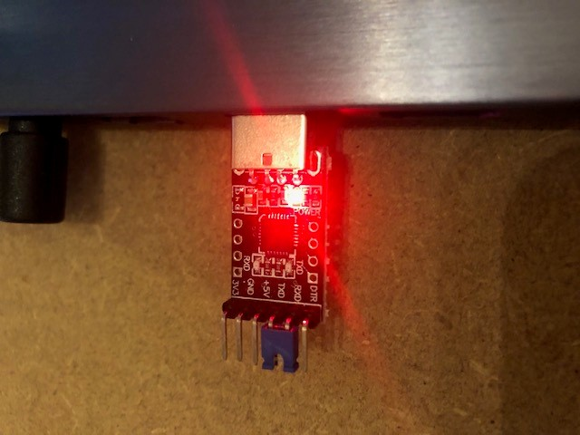
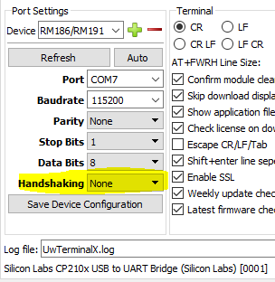
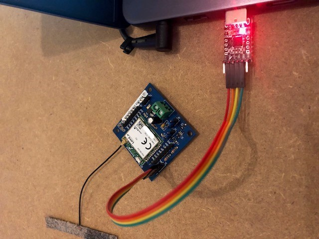
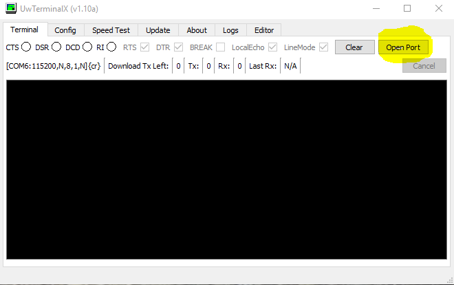
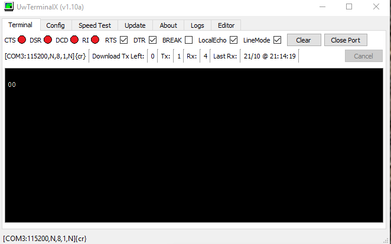

# Aansluiten op de laptop
Om met de node te kunnen communiceren wordt gebruik gemaakt van een USB-Serial adapter van Silicon Labs, type CP2101. Voor Windows en OSX moeten hiervoor drivers gebruikt worden die geen onderdeel (lijken) te zijn van het standaard OS.

Ga naar [de SIlabs download pagina](https://www.silabs.com/products/development-tools/software/usb-to-uart-bridge-vcp-drivers) en download daar de drivers voor je OS.

## Windows
Pak de ZIP file uit. Plug nu de adapter in de laptop. Gebruik 'Windows'-X Apparaat Beheer en kies het apparaat met een uitroepteken. Update de drivers van de lokale PC door naar de map waarin deze uitgepakt zijn te bladeren.

## OSX
Installeer de driver. Steek de adapter in de USB poort. Als er nu geen nieuwe device in /dev zichtbaar wordt, raadpleeg dan [dir stackoverlow artikel](https://stackoverflow.com/questions/47109036/cp2102-device-is-not-listed-in-dev-on-macos-10-13)

## De adapter testen
Om te testen of de adapter correct werkt plaatsen we een jumper over de RX en TX pin.

Start nu UwTerminalX en kies in het instellingen scherm de correcte 'com' poort. Zet 'handshaking' op 'None'. En kies bij 'Device' voor 'RM186/RM191'.

Klik op OK en type een paar letters gevolgd door enter. Na de return moet de getypte tekst nogmaals verschijnen.

## De node aansluiten
Nu we weten dat de communicatie werkt gaan we de node op de laptop aansluiten. Haal eerst de USB-serie adapter uit de laptop en verwijder de jumper. Zet nu jumpers op de bovenste twee pinnen van zowel J5 als van J8.
Neem de vier aderige kabel en sluit die aan op de middelste 4 pinnen van de USB-serie adapter. Sluit de andere kant aan op de vierpolige connector van de node, let op de volgorde van aansluiten. (Zowel op de USB adapter als op de node staat opdruk, zorg dat de draden lopen tussen overeenkomende pennen)

Sluit nu de adapter weer aan op de laptop.

Sluit eventueel de popup van UwTerminalX en klik op 'Open Port'

Druk op enter, nu moet als antwoord 00 verschijnen. Controleer of 'Handshaking' nog op 'None' staat als er geen uitvoer verschijnt.

De node is nu aangesloten en gereed om een programma of commando's te ontvangen.
