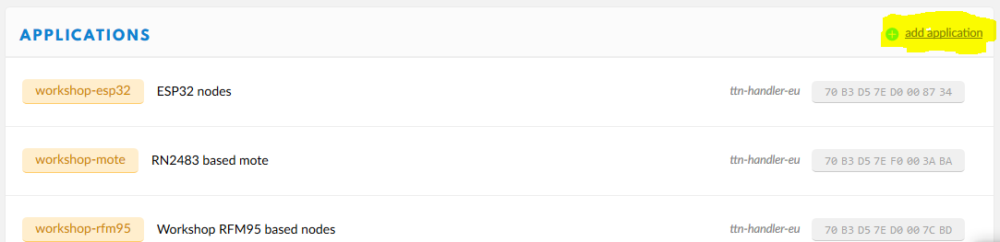
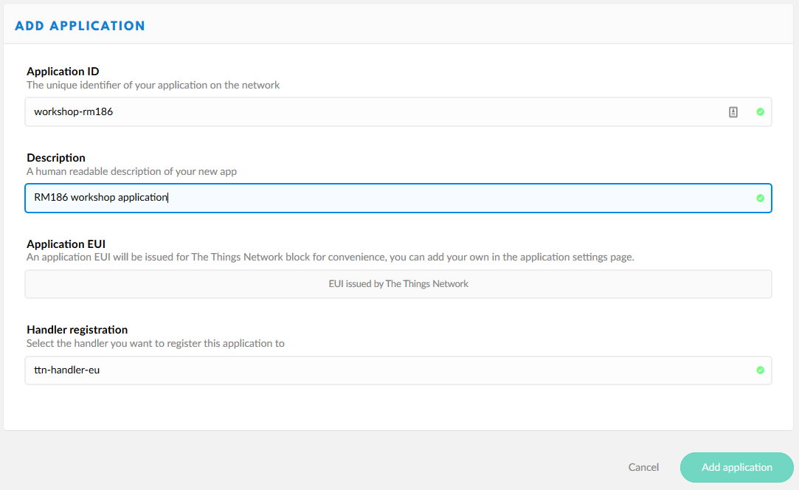
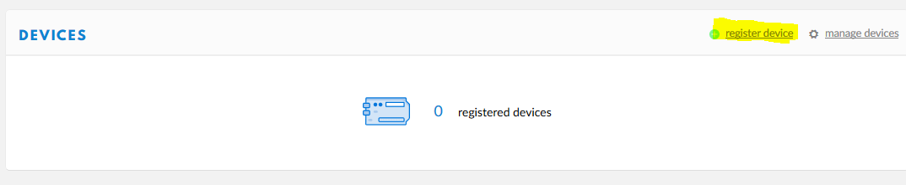

# Een nieuwe applicatie bij TTN
Om de node te kunnen gebruiken om data naar TTN te zenden zullen we eerst op TTN een nieuwe applicatie moeten aanmaken.

Log in op de [console](https://console.thethingsnetwork.org) (maak eerst een account als je dat nog niet hebt) en kies voor 'Applications'.

Kies nu "add application" om een nieuwe applicatie aan te maken.



Vul een unieke application ID in en een beschrijving. Klik op 'Add application'



Kies bij 'Devices' voor 'register device'.



Geef het device een voor deze applicatie unieke naam. Nu moet de EUI ingevuld worden, die staat bovenop de RM186 module gedrukt (start met C0EE), een makkelijker manier om die in te vullen is om onderstaande code op de module uit te voeren (in [eerste programma](programma.md) hebben we gezien hoe dat moet)

````
#include "RM1xx-defs.h"

DIM rc
DIM val$

rc = LORAMACGetOption(LORAMAC_OPT_DEV_EUI, val$)
PRINT "EUI: ";val$;"\n"
````
[RM1xx-defs.h](software/RM1xx-defs.h)

Knip en plak de uitvoer van het programma naar de 'Device EUI' op de webpagina en klik op 'Register'.


De node is nu aangemeld bij een nieuwe applicatie op TTN. Nu moeten we de node configureren met de gegevens van de applicatie, namelijk de Application EUI en de App Key.

Type in UwTerminalX de commando's:
- AT +CFGEX 1010 "Application EUI van de TTN webpagina"
- AT +CFGEX 1012 "App Key van de TTN webpagina"

N.B. De aanhalingstekens zijn onderdeel van het commando. Zonder aanhalingstekens geeft de module een antwoord ongelijk aan 00, hetgeen betekend dat de sleutels niet geaccepteerd/opgeslagen zijn.

Deze instellingen worden pas actief na een reset, dus besluit met "ATZ".
