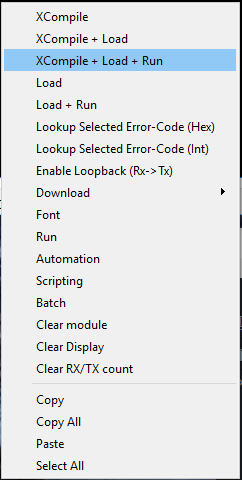
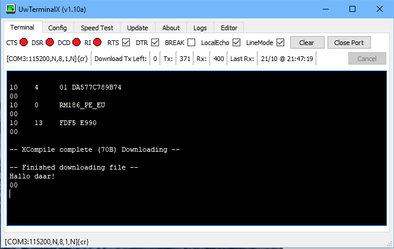

# Het eerste programma
Het wordt tijd om ons eerste programma in de module te stoppen. We beginnen simpel, nog niks met LoRaWAN, maar gewoon uitvoer naar de seriele verbinding.

Open de gekozen programma editor en kopieer de volgende regels
````
// Simpel testje
PRINT "Hallo daar!"
````

Sla het programma op met de naam test.sb.

Ga nu naar UwTerminalX en gebruik de rechter muisknop in het zwarte deel van het venster. Er opent nu een menu:


Kies 'XCompile + Load + Run'. Selecteer nu je test programma en klik op 'Open'.

Het programma wordt nu vertaald naar byte code, naar de module verzonden en gestart.


