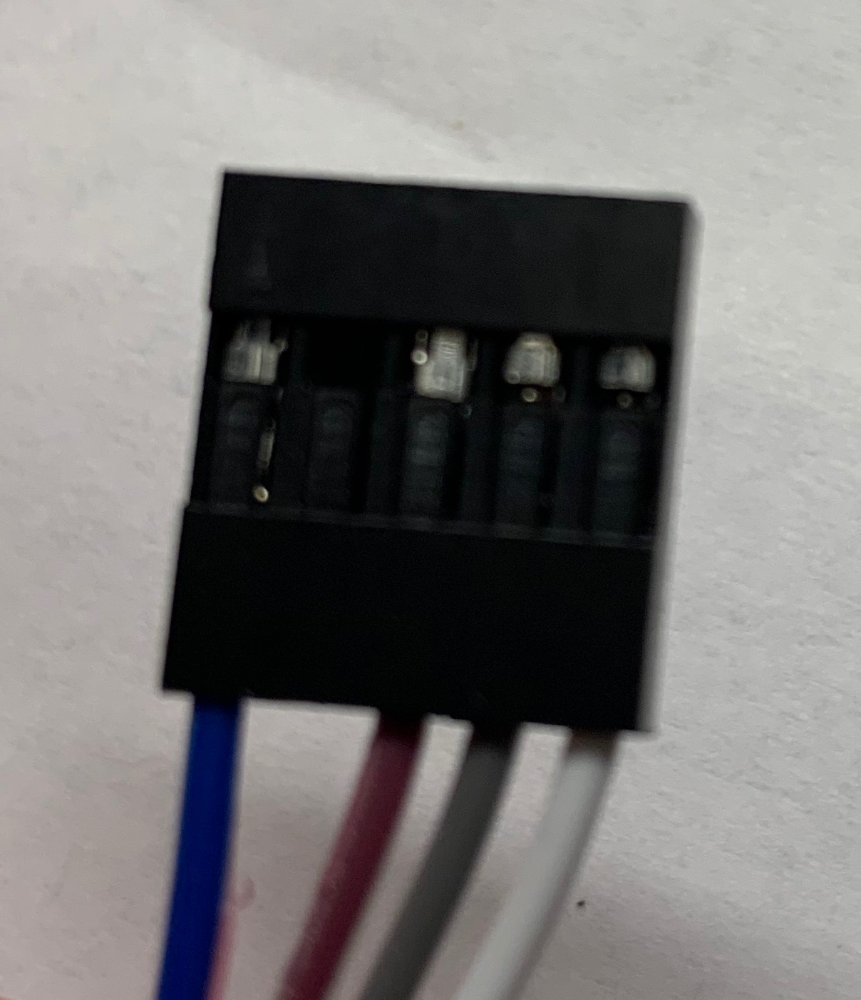

# Fijnstofmeter die data verstuurt naar het RIVM

Uitgangssituatie: de node kan verbinden met LoRa en je kunt data versturen en ontvangen in TTN. Zie vorige workshop.

## Voor geavanceerde gebruiker
### 1) voeding
Soldeer de +5V en GND op de micro USB dip adapter. Sluit de GND aan op de linker aansluiting van de groene connector (die aan de kant van jumper J8) en de +5V op de rechter connector. Als je de voeding van de micro USB wilt gebruiken, dan moet J8 naar beneden staan (dus naar de rand van de printplaat). Als je de voeding van de USB->TTL convertor wilt gebruiken, dan moet J8 omhoog staan (dus niet aan de rand van de printplaat).

### 2) BME280
Sluit de BME280 aan op I2C, GND en 3.3V van het node.

### 3) SDS011
Sluit de +5V en GND van de SDS aan op de groene schroefconnector. Als de connector aan de onderkant ligt, is de linker aansluiting GND en de rechteraansluiting +5V. Sluit TXD van de SDS aan op de RX van de node; en dus de RXD van de SDS op de TX van de node. 

### 4) programmeer node
Er is maar 1 seriële poort dus als je de node gaat programmeren, dan moet je de SDS even loshalen en na het programmeren weer aansluiten. Dus haal de SDS los, sluit de USB-TTL convertor aan, programmeer ‘sdsbme.sb’ op de node (zie vorige workshop). Als alles goed werkt, dan kun je deze file hernoemen naar ‘$autorun$.sdsbme.sb’ en opnieuw uploaden zodat die automatisch op start. Om een nieuwe versie te programmeren als een autorun actief is, moet je een aparte verbinding op de node maken (zie vorige workshop). Als het programmeren is gelukt, sluit dan de SDS weer goed aan.

### 5) TTN
Kijk of je data binnen krijgt op TTN. Gebruik de ‘payload_decoder.js’ om de data te decoderen.

### 6) todo - één gemeenschappelijke applicatie om via MQTT data naar RIVM te versturen.

## Voor de beginner:
### 1) Connector aan de SDS
Neem 4 dupont female-female wires. Op de foto staan wit/grijs/bruin/blauw. Pruts aan één kant de 4 female pennen los uit de omhulsels (wip een plastic omhulsel los en haal de pen eruit. Doe deze vier female pinnen in een 5 pins Dupont plastic behuizing. Doe wit/grijs/bruin aan 1 kant, sla 1 gat over en doe de laatste in het vijfde gat.  Steek deze gemaakte stekker in de SDS, zo rechts mogelijk. 

### 2) SDS aansluiten op node
Knip de dupont stekkers van de draden bruin/blauw. Strip deze draden ongeveer 8 mm. Doe de grijze draad op TX van J1 en de witte op RX van J1. De draden bruin/blauw wordt nu niets mee gedaan. 

### 3) micro USB
Soldeer twee draden aan de micro USB op de GND en VCC. Hier zijn grijs gebruikt voor GND en wit voor VCC. De VCC is +5V en die is ook nodig om de SDS011 te voeden. De txd/rxd van de SDS011 zijn 3.3V dus die kunnen direct worden aangesloten zonder conversie (zie stap 2). 

### 4) sluit micro USB voeding aan op de node
Wikkel de witte en blauwe draad om elkaar en schroef deze in het rechter gat van de groene schroefconnector. Dit is de VCC van de micro USB en van de SDS011. Doe hetzelfde met de grijze en bruine draad. Dit zijn de GND van de micro USB en de SDS011. 

### 5) Jumper 8
Jumper 8 bepaalt waar de node zijn voeding vandaan haalt: van de USB->TTL convertor (J8 over bovenste twee pinnen) of de micro USB (J8 over de onderste twee pinnen dus aan de rand van de node). Laat J8 nu op de bovenste twee pinnen. 

### 6) BME
Soldeer de 2 pin header female op de BME280 op de pinnen SCL en SDA. Knip twee female duping wires op lengte van 6 en 3 cm, soldeer die op de VCC en GND. Hier is rood gebruikt voor VCC en zwart voor GND. 

### 7) BME op node
Plaats de 2 pin header female op de pinnen SCL en SDA van de node. Sluit de zware dupond draad aan op de GND en de rode op de 3v3. 

### 8) adem door
Je hebt het hardware stuk overleefd, op naar de software configuratie.

### 9) Programmeer de node
Er is maar 1 seriële poort dus als je de node gaat programmeren, dan moet je de SDS even loshalen en na het programmeren weer aansluiten. Dus haal de SDS los en sluit de USB-TTL convertor aan.  
Programmeer ‘$autorun$.sdsbme.sb’ op de node (zie vorige workshop). Als het programmeren gelukt is, haal dan de USB->TTL los, verbind de SDS011 op de juiste wijze met tx en rx (zie stap 2).  
Let op: de node start nu automatisch en je kunt niet een andere file programmeren omdat die niet meer in de programmeermode staat. Hiervoor met je de autorun uitzetten met een dupontwire. Zie vorige workshop.

### 10) TTN
Log in op TTN en zoek de data van je device.

### 11) Zet J8 om naar onderen, dus richting de rand van de PCB. 

### 12) start de node
Voed de node nu met micro USB. De node zal starten en de ventilator van de SDS zal gaan draaien. Als het goed is, zie je in TTN de node zich registreren en om de 5 minuten data versturen. So far so good!

### 13) decodeer de data van de node
De node verstuurt de data in een compact formaat. Kopieer de payload_decoder.js van Github naar TTN en je zult zien dat de data betekenis krijgt.

### 14) monteer alles op het frame
De micro USB 
De SDS011  
En de node 

### 14) @@TODO data naar RIVM
Er is een gemeenschappelijke applicatie gemaakt op TTN waar iedereen toegang toe krijgt (stuur via Meetup een mail met je TTN account naam naar Jac). Je kunt je node hier registreren, de data bekijken. Let erop dat je bij de registratie van de node ook GPS-coordinaten opgeeft (het mag ivm privacy 100 meter afwijken). Dit gebruikt RIVM om de node op een kaart te plaatsen en verplaatsing van verontreiniging te monitoren. RIVM zal met MQTT verbinden met deze applicatie en op deze wijze de data ophalen. Op [RIVM samenmeten](https://samenmeten.rivm.nl/dataportaal/) kun je alle sensoren zien en als het goed is ook die van jou.

# Behuizing
Voor de behuizing is [op ThingiVerse](https://www.thingiverse.com/thing:3181167) een ontwerp te vinden. Print de bovenkant, onderkant en een aantal maal het tussenstuk. Print ook een van de twee bevestigingsbeugels. Voor de houder van de onderdelen staat de STL hier op GitHub in de map '3d files'.
Met 3 stukken op maat gezaagd M4 draadeind en enkele moeren worden alle onderdelen aan elkaar gezet waarna het geheel gemonteerd kan worden. In de buis bevestiging zitten gaten voor tiewraps.
